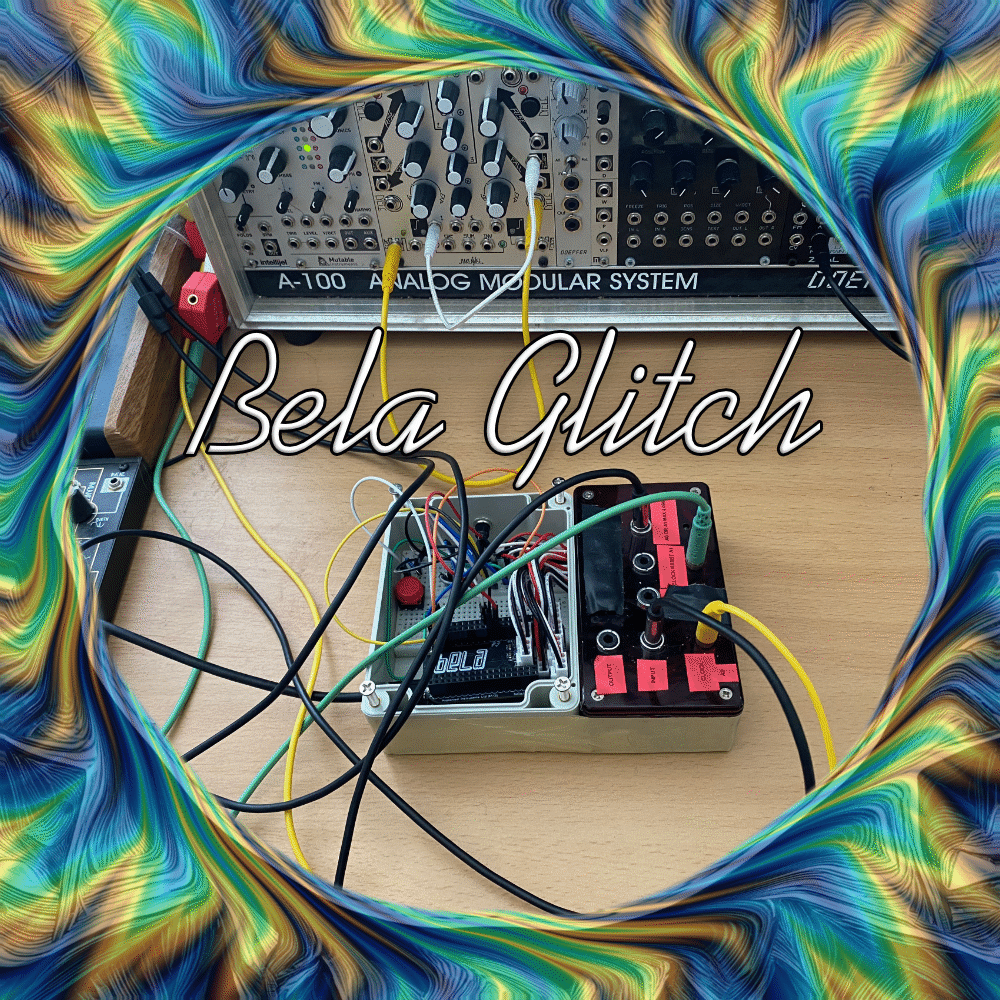

# GlitchMini

**GlitchMini** is a hardware-based glitch effect application built on the Bela Mini with expander channels. It provides an analog-style glitch effect with varying subdivisions (16th, 32nd, 64th, 128th), offering a unique sound compared to the perfect digital glitch of a VST.

## Features

- **Channel INPUT 0/1** Stereo Input
- **Channel OUT 0/1:** Stereo 16th note glitch
- **Channel OUT 2/3:** Stereo 32nd note glitch
- **Channel OUT 4/5:** Stereo 64th note glitch
- **Channel OUT 6/7:** Stereo 128th note glitch
- **Clock Input (PPQN 48):** A0
- **Clock Reset (Trigger):** A1

## Hardware Requirements

- Bela Mini + Channel Expander
- 2 Mono Mini Jack Inputs
- 2 Push Buttons
- Resistors + LED for visual feedback

### Push Buttons

1. **Button 1 (Shutdown):** Safely powers down the Bela Mini. Since Bela operates like a computer, proper shutdown is required to avoid system issues.
2. **Button 2 (Glitch Mode):** Switches between frozen glitch patterns.

### Voltage Warning

Make sure to use appropriate voltages on the mini jack inputs. Excessive voltage could damage the Bela hardware. Always check the voltage range before connecting to the Bela. I am not responsible for any damage caused by improper voltage handling. Please follow best practices when working with sensitive electronics.

## Setup

1. Connect the Bela Mini and Expander.
2. Wire the mono mini jacks for clock input (PPQN 48 on A0) and clock reset (A1) trigger.
3. Connect the push buttons:
    - **Button 1**: Shutdown function
    - **Button 2**: Change frozen glitch patterns
4. Add resistors and an LED for visual indication (optional but recommended).
5. Respect voltage levels when connecting external devices.

Refer to the wiring schema in the repository: **bela.Glitch.pdf** for detailed instructions on how to set everything up.### Clock and Reset

- **Clock Input (A0)**: Drives the glitch based on external clock signals (PPQN 48).
- **Clock Reset (A1)**: A trigger input to reset the pattern. This could be a single trigger sent at the start of a pattern in Ableton Live, for instance.

## Usage

1. Start your glitch patterns by providing a clock signal to A0.
2. Use the second push button to switch glitch patterns while playing.
3. Make sure to safely shut down your Bela Mini using the first button when you're done.

## License

This project is open-source. Please use it responsibly and ensure you work with the correct voltage levels to protect your hardware!